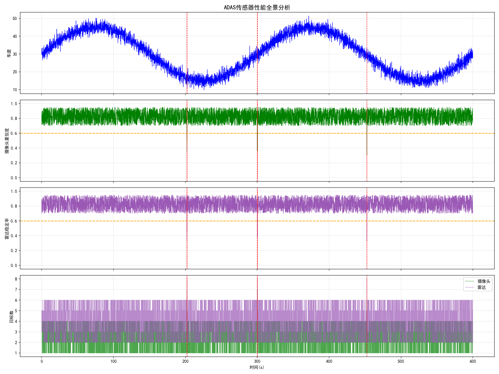
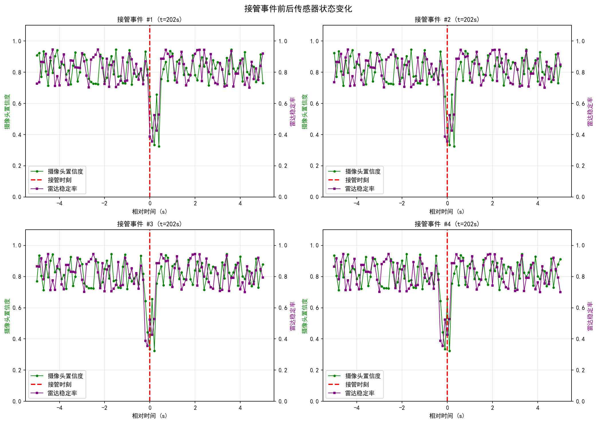
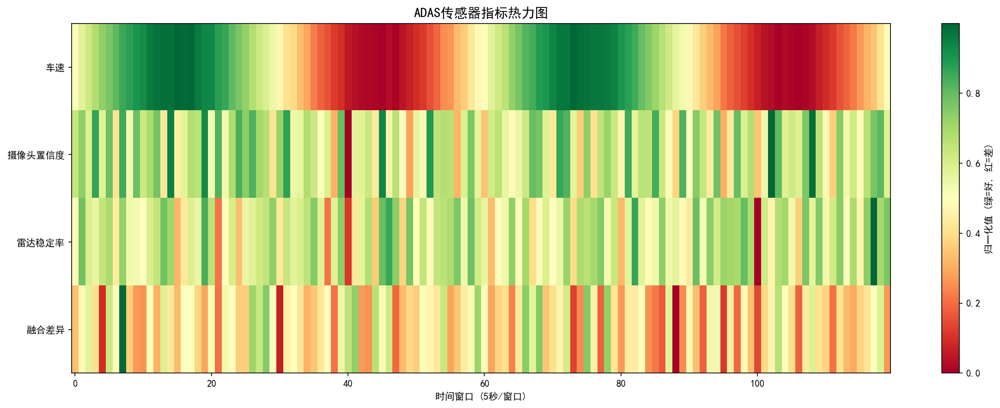

```markdown
# 🚗 自动驾驶场景挖掘与分析平台

[](https://www.python.org/)
[](LICENSE)

> 从海量路测数据中自动挖掘关键场景，分析ADAS传感器性能与接管根因，加速自动驾驶Corner Case库构建。

## ✨ 核心功能

| 模块 | 功能 | 技术实现 |
|------|------|----------|
| 🛑 急刹车检测 | 自动识别急减速事件 | 状态机 + 滑动窗口，最小持续时长约束 |
| 🔬 接管根因分析 | 自动归因接管原因 | 4类规则分类器，多维时序特征 |
| 📷 摄像头分析 | 目标置信度/距离分布评估 | 目标检测统计 + 低置信度告警 |
| 📡 雷达分析 | 跟踪稳定性/RCS评估 | 目标跟踪状态统计 + 热力图 |
| 🔗 融合一致性 | 跨传感器偏差检测 | 距离匹配算法 + 异常时段定位 |
| 🔎 场景检索引擎 | 相似场景快速检索 | 49维特征编码 + 余弦相似度 |
| 📊 可视化报告 | 自动生成完整分析报告 | 4类图表 + HTML汇总页面 |

## 🎯 应用场景

- **Corner Case挖掘**：从TB级日志中自动提取危险场景
- **传感器性能评估**：量化摄像头/雷达/融合的性能指标
- **接管根因归因**：分析接管原因分布，指导功能优化
- **回归测试**：搜索相似场景，加速算法迭代验证

## 📂 项目结构

```
auto-drive-scenario-mining/
├── integrated_platform.py     # 主程序
├── requirements.txt           # 依赖
├── .gitignore
├── README.md
└── reports/                   # 运行后自动生成
    ├── adas_sensor_performance.png      # 传感器性能全景图
    ├── takeover_sensor_context.png      # 接管前后传感器状态
    ├── sensor_fusion_heatmap.png        # 融合一致性热力图
    └── adas_report.html                 # HTML汇总报告
```

## 🚀 快速开始

```bash
# 克隆项目
git clone https://github.com/Wlc-user/auto-drive-scenario-mining.git
cd auto-drive-scenario-mining

# 安装依赖
pip install -r requirements.txt

# 运行
python integrated_platform.py
```

## 📊 运行效果

### 传感器性能全景图



### 接管事件传感器上下文



### 传感器融合热力图


## 🔧 核心技术

### 1. 传感器融合一致性评估
通过摄像头和雷达目标在距离维度的匹配，计算融合一致性分数，自动标记高不一致时段：
- 匹配阈值：3米内视为同一目标
- 异常判定：平均距离差异 > 5m 或高不一致帧数 > 5%

### 2. 场景特征编码
将场景片段压缩为49维特征向量：
- **统计特征**（18维）：均值/标准差/极值/分位数 × 3信号
- **频域特征**（15维）：FFT前5分量 × 3信号
- **分布特征**（15维）：直方图分布 × 3信号

### 3. 接管根因分类
基于多维度特征自动归因：

| 条件 | 根因 |
|------|------|
| min_TTC < 2.0s | 前向碰撞风险 |
| 车道偏离 > 0.5m | 车道保持异常 |
| 减速度 < -5.0 m/s² | 紧急制动触发 |
| 目标丢失 + 距离近 | 传感器遮挡 |
| 其他 | 驾驶员主动介入 |

## 🛠 技术栈

- **数据处理**：Pandas / NumPy
- **机器学习**：Scikit-learn（PCA降维 / 标准化）
- **可视化**：Matplotlib（4类专业图表）
- **架构设计**：模块化 + 数据类 + 面向对象

## 📈 面试要点

这个项目体现的能力：

- **算法设计**：状态机检测、特征工程、融合一致性评估
- **系统工程**：模块化架构、大数据处理思路、内存优化
- **领域理解**：ADAS传感器原理、接管场景分析、Corner Case挖掘
- **工程权衡**：精度vs效率、降采样策略、可扩展性设计

## 📝 License

MIT License

## ⭐ Star History

如果这个项目对你有帮助，欢迎 Star ⭐
```

保存后提交：

```powershell
git add README.md
git commit -m "docs: 完善README"
git push
```
